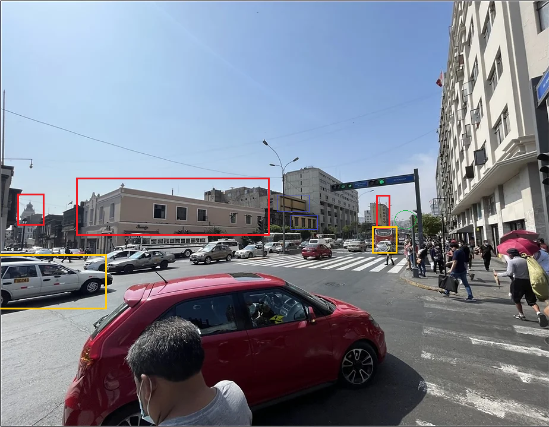
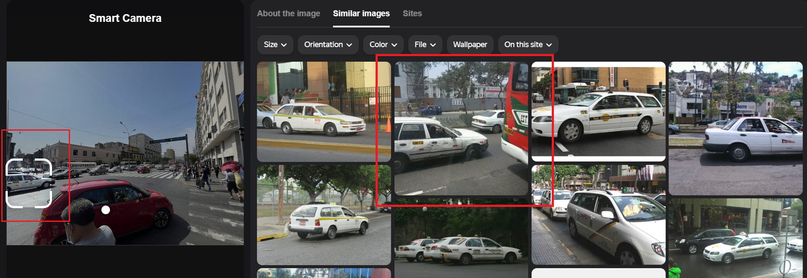
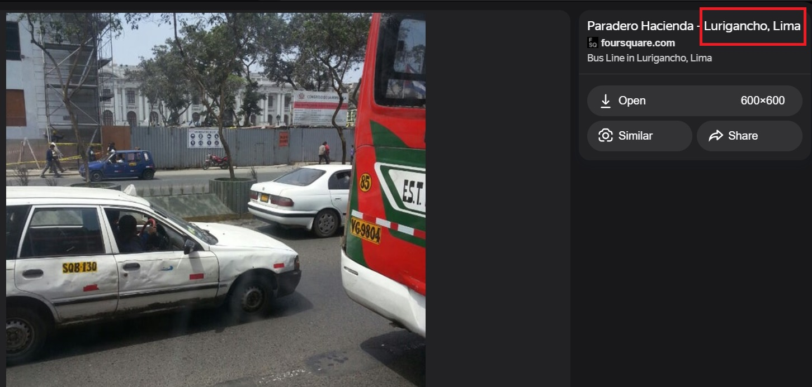
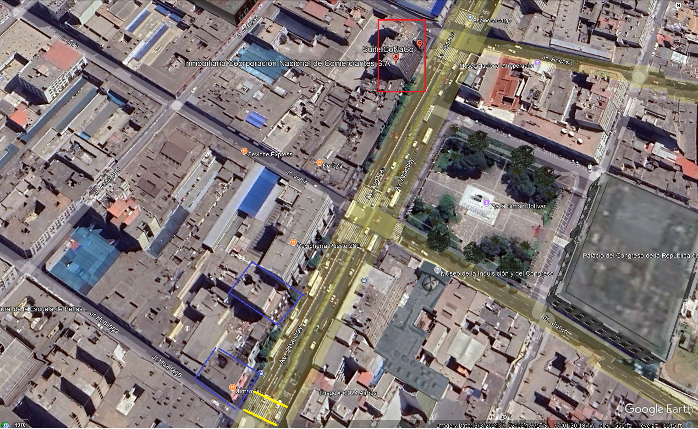

[Article Link](https://www.osintcombine.com/post/from-images-to-intelligence)

**Location:**
1. **Long:  77° 1'37.59"W**
2. **Lat:  12° 2'55.70"S**
**Solving time:**
Less Than **30 Minutes.**

#### Description: 
This Photo wasn't from a challenge it was from article called [from-images-to-intelligence](https://www.osintcombine.com/post/from-images-to-intelligence) on [osintcombine](www.osintcombine.com) , but I Geolocated this photo with another way than the writer did and it took a little time and step, so here is a walkthrough in how I Solved it.

/Source.png) 

#### Solving Steps:
Let's identify the main features in the picture: 
**The first thing I noticed very clear was a building in the end of the photo that called "CONACO"**. 
I wanted to mention **"CONACO"** separately because it is the sign I will start from. 

but let's define another highlights:

**Main Elements in This photo:**
1. CONACO building. 
2. Mountain in the background (green circle).
3. In the down far left of the photo there is a building with a distinctive dome. (red rectangle). 
4. White Taxi and Red bus. (Yellow rectangles).

**Secondary Elements in This photo:**
1. building that have a unique structure (blue squares).
2. the vintage building that have two corners.
3. Pedestrian crossing line.

**Searching Steps:**
1. Using "Yandex" browser To search for the Taxi and this the result:
   
   
	   we will find similar bus and taxi in another photo in **"Lima"** 

2. Now after we knew that this picture was taken in "Peru, Lima" then we will go to **"Google Earth"** and search for **"CONACO"** in Lima.
	
	With a first look For The map we will find two of our main elements (CONACO, building with a dome).
3. If we make it closer other elements main and second will appear:
   
	   1. Building with a unique structure (top blue square).
	   2. Vintage building with two corners.
	   3. Pedestrian crossing line.

4. Now Let's change the Perspective of the Map: 
	/Result.png)
	After changing the perspective we will find all elements:
		1. Building with "CONACO" Signal (Red rectangle).
		2. Building With A Dome (red rectangle).
		3. White taxi and red bus (yellow rectangles).
		4. Vintage Building with two corners (dark red rectangle).
		5. Building with a unique structure (Blue rectangle).
		6. Mountain (Green Circle).
5. The Results are: 
	1. **Long:  77° 1'37.59"W**
    2. **Lat:  12° 2'55.70"S**
   

