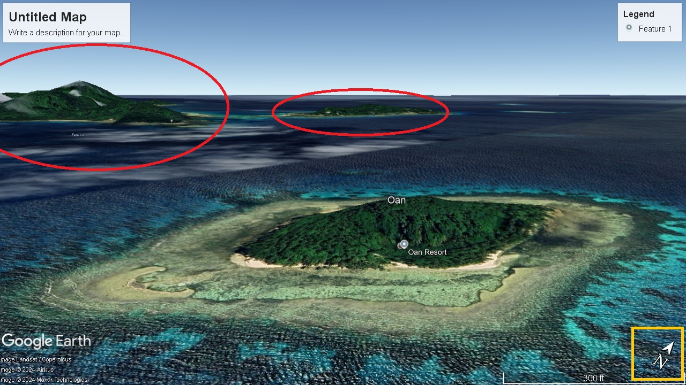

[Challenge Link](https://gralhix.com/list-of-osint-exercises/osint-exercise-005/)

#### Description:

This is a photo of a resort located on an island.  
a) What is the name of the resort?  
b) What are the coordinates of the island?  
c) In which cardinal direction was the camera facing when the photo was taken?

#### Solution:
* Using google image search at first the result was:
  /Search-result.jpg)
The Result was a website for a resort called "Oan Resort" with the same photo. [website Link](https://oanresort.wixsite.com/chuuk)

now we know the resort name **"Oan"** but let's get sure with google earth.

* Using google earth we will find that this the same island with the far small island and the mountain in the left, and using the compass we will know which direction does the photographer look at.
**So results will be:**

**Resort name**: OAN Resort
**Resort website**: https://oanresort.wixsite.com/chuuk/about
**Island name**: Oan Island 
**Oan Location** : Wonip, Chuuk, Micronesia 
**Island coordinates:** 
1. **Lat:**   7°21'38.56"N
2. **Long:** 151°45'23.23"E
**Cardinal direction was**:   North West

