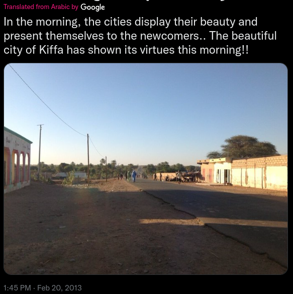
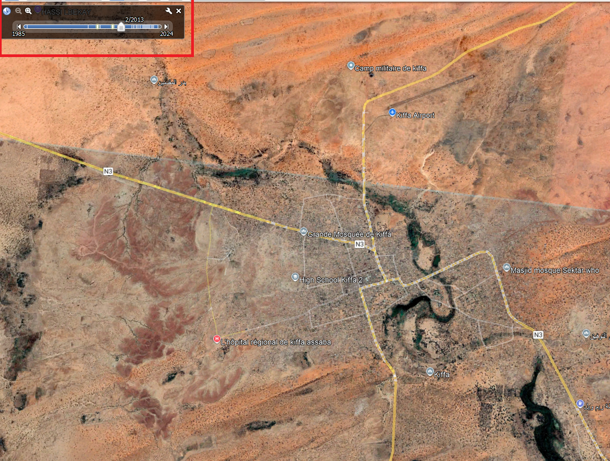
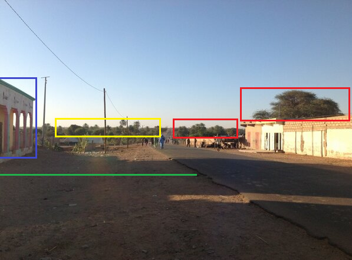
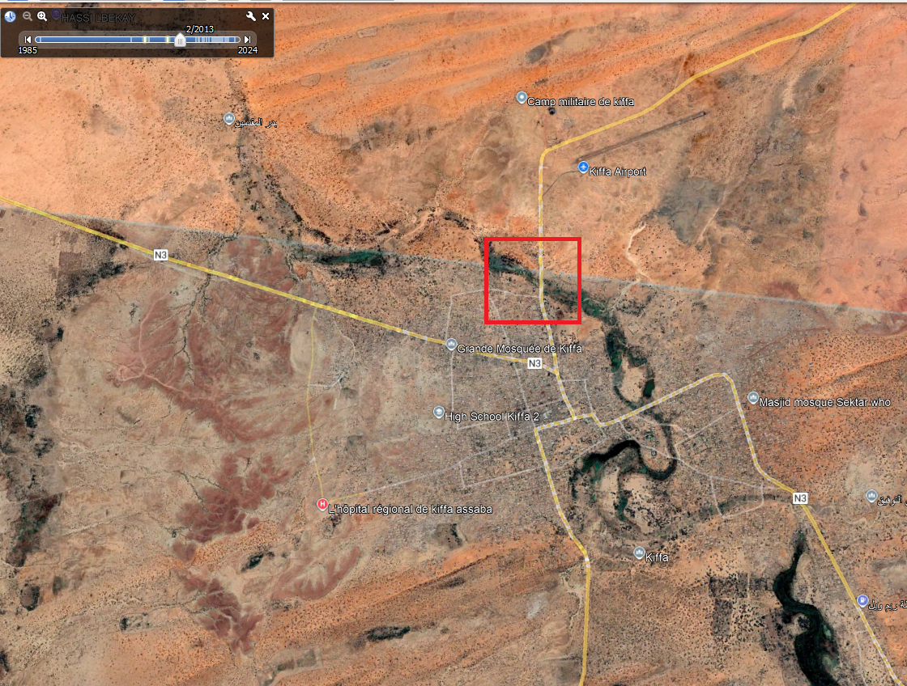
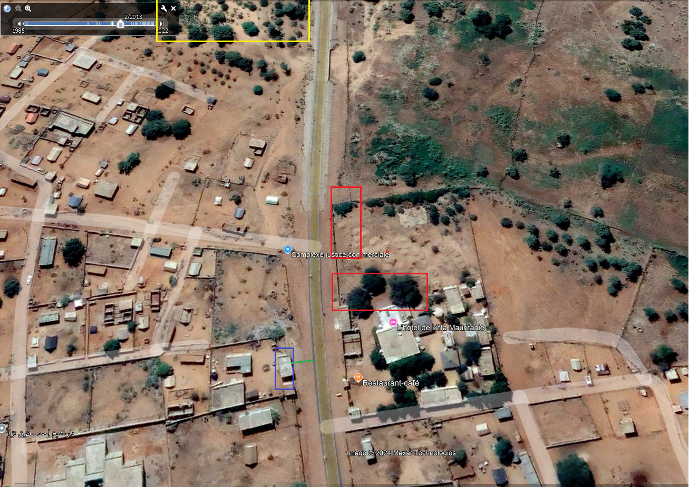

[Challenge Link](https://gralhix.com/list-of-osint-exercises/osint-exercise-001/)

Steps in Solving:
1. First look at the photo I thought it's Afghanistan because of the woman blue wear and for the Arabic source I didn't give attention to it.
2. The city name is in the tweet post so it shorted the way for me a lot searching only in the city.
3. using Google Earth trying to find a road with the same specifications but before that I changed the date to the date in the post **Feb 20, 2013** 
4. Looking again to the resource photo to figure the main specifications:
   
   looking at this photo we will see: 
	   1. Long way reaching to a far place, may be out of the city. (We have to consider it)
	   2. Small house in the right behind it some sort of heavy tree (red 1)
	   3. After the house there is something like a small wall with trees at the end.(red 2)
	   4. After right building Obviously there is nothing.
	   5. in the left side there is building after it an empty space.(blue)
	   6. after empty space there is heavy green area.(Yellow).
	   7. There is a large space between the left building and the road (green line).
5. back again to our map: 
	we will find that the top road is only road the reaching to a distant place with a green area in it and the end of the road is an empty space. 
6. By Zooming we will find the exact place:
   

In the end the exact location of this photo is :
1. **Lang:  11°23'51.97"W** 
2. **Lat:  16°36'34.06"N**
3. Solving Time: 15 Mins

