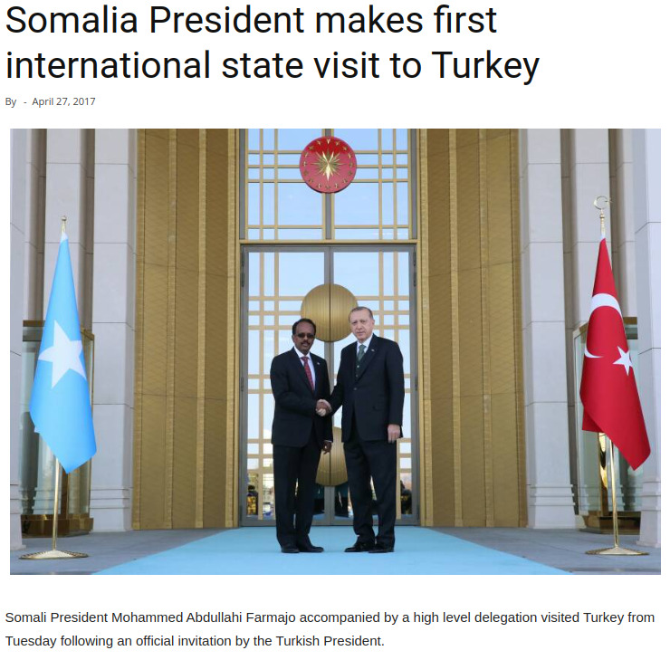
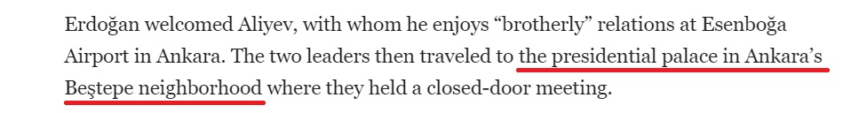
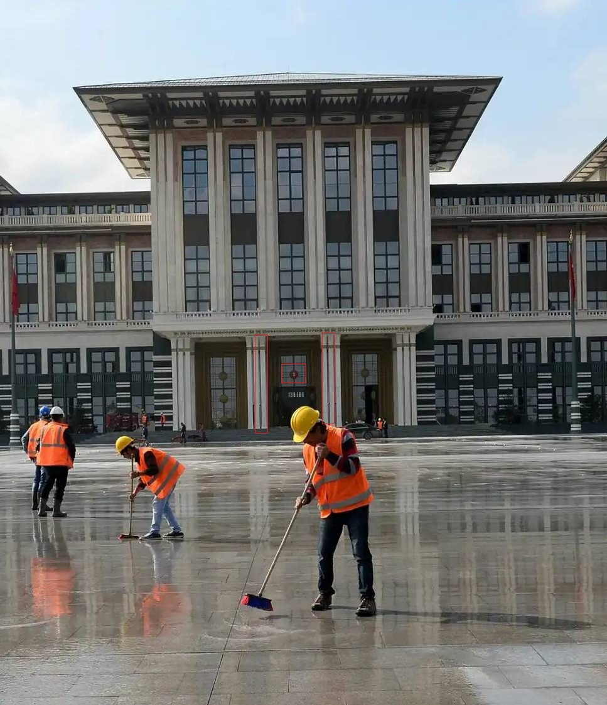

[Challenge Link](https://gralhix.com/list-of-osint-exercises/osint-exercise-003/)

#### Description:
in April 2017 Mohamed Abdullahi Farmaajo, the then president of Somalia, visited Turkey. A news agency published a photo where he was seen shaking hands with Recep Tayyip Erdoğan, the country’s president. 
The article did not disclose where the photo was taken. **Your task is to find out the name and coordinates of the location seen below.**

Starting by analyzing this Photo:
The main info we know here is the date of this visiting which is: **27 Apr, 2017**

what I will do know first reverse image search and search for specific details about the visit on google:
In this [Article](https://turkishminute.com/2024/06/10/erdogan-receive-azerbaijani-president-ankara/) with title "Erdoğan receives Azerbaijani president in Ankara" we will find the the palace which is identically with the source:

In the Article mentioned that the Palace Name is "Presidential Palace in Ankara's Be(sh)tepe neighborhood : 'Presidential Complex of Turkey'"

in this [article](https://www.theguardian.com/world/gallery/2014/oct/29/turkeys-new-presidential-palace-unveiled-in-pictures) from the Guardian "Turkey's new presidential palace unveiled - in pictures", we will find a picture for the frontside of the palace: 

#### Results: 
The palace name: **Presidential Complex of Turkey in Ankara.**
Palace Coordination's:
1. **Lat:  39°55'51.02"N** 
2. **Long:  32°47'54.93"E**

**Solving Time: 5 Mins**