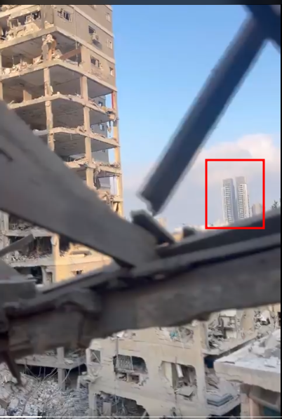
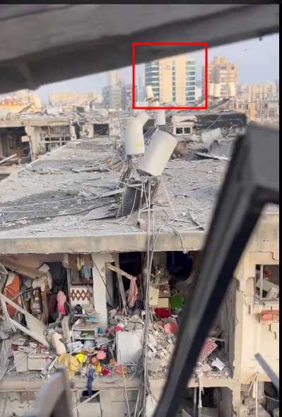
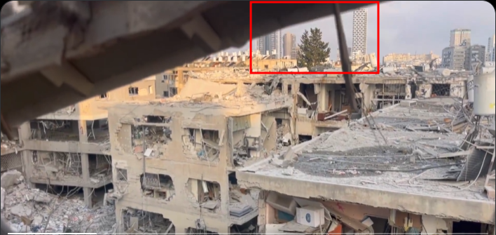
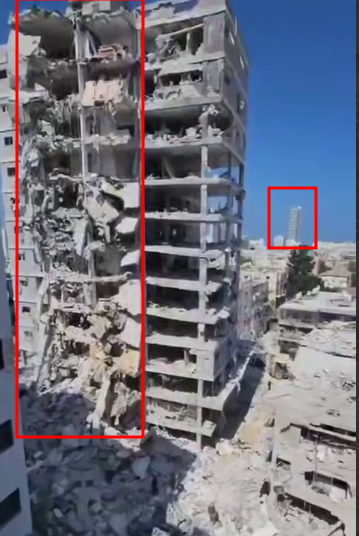
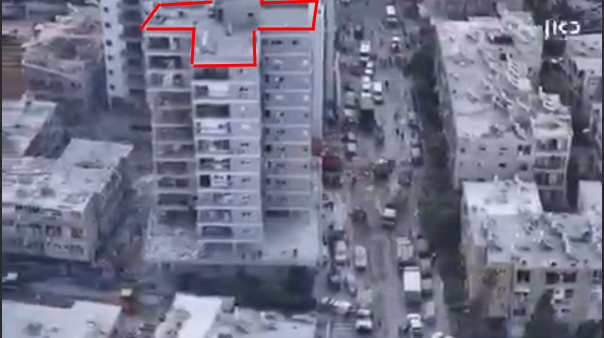
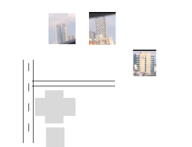
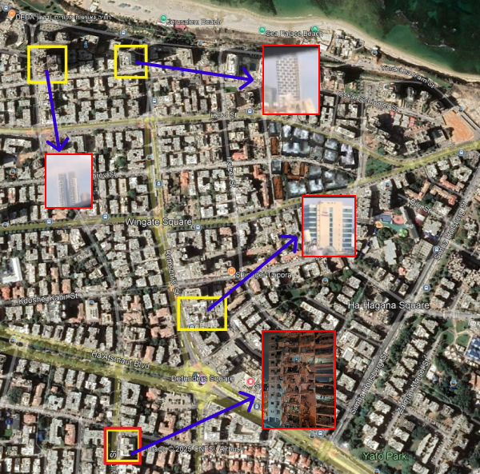

location:
**32° 1'33.65"N  34°44'58.70"E**

Pictures from the attack site:

**From these pictures, this what we are searching For:**

And this is what we found:

**The Location of this building is:** 
**32° 1'33.65"N  34°44'58.70"E**