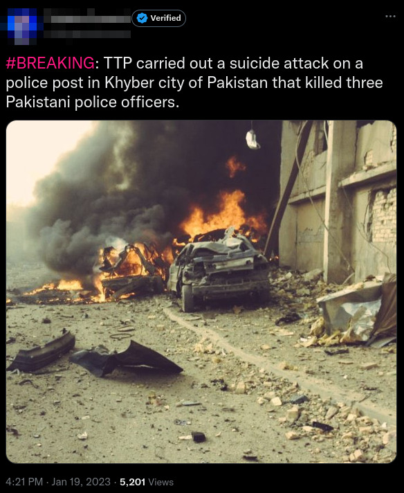
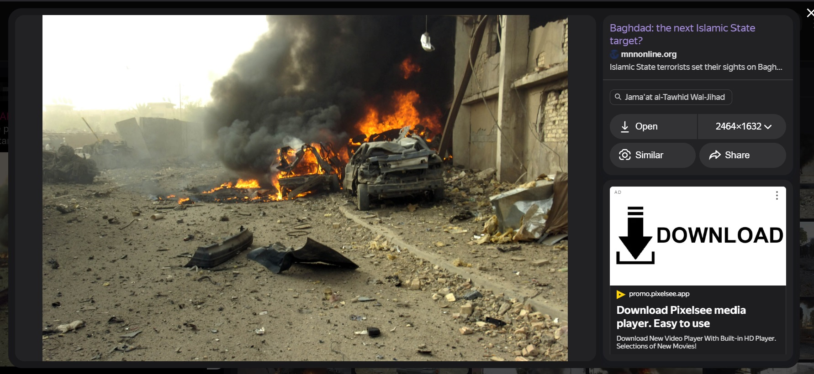
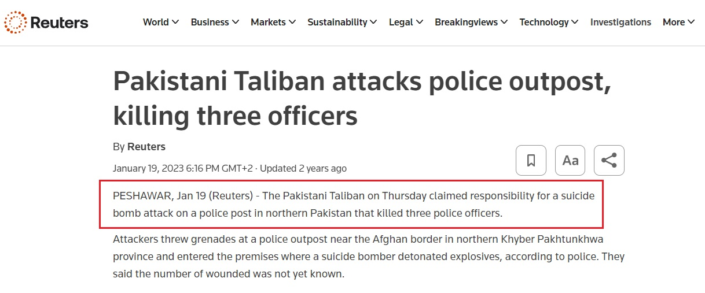
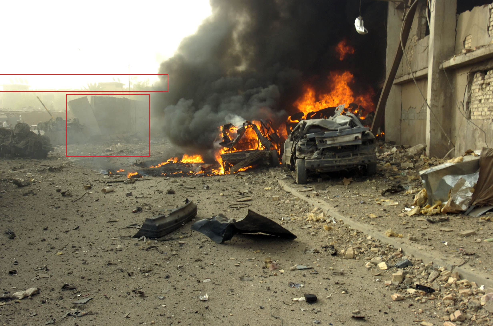

[Challenge Link](https://gralhix.com/list-of-osint-exercises/osint-exercise-006/)

#### Description:

On January 19, 2023, a journalist with almost 140k followers on Twitter shared an image of a destroyed vehicle amidst a large cloud of smoke and fire. The tweet said: “_BREAKING: TTP_ _carried out a suicide attack on a police post in Khyber city of Pakistan that killed three Pakistani police officers._“  
  
The photo is not of the event described by the journalist.  
a) Verify the statement above.

#### Solution:
1. Using Yandex to search for similar photos I found the same photo from an [Article](https://www.mnnonline.org/news/islamic-state-targeting-baghdad/) says that this bombing in **"Baghdad"**. 
	
2. But let's search for a suicide attack in Pakistan in Jan 19 2023, we will find article from [Reuters](https://www.reuters.com/world/asia-pacific/pakistani-taliban-attacks-police-outpost-killing-three-officers-2023-01-19/) 
3. What I will do now is searching for this suicidal attack and locate the police station finding if it is identical with photo in tweet?
	in this [Article](https://tribune.com.pk/story/2396787/two-cops-martyred-in-ttp-led-terrorist-attack) we will find the check post location: "Takhta Baig checkpost in the district's Jamrud area", and we will find the same news with the same location on [Pakistan Today](https://www.pakistantoday.com.pk/2023/01/20/two-policemen-martyred-in-suicide-attack-on-jamrud-checkpost/) 
4. So let's go to Google earth and find out this location:
	  

	With direct vision only, we will find that the two places are different.

Solving time: 10 mins.