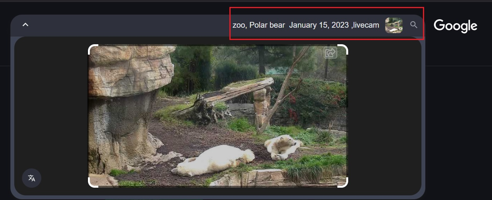

[Challenge link](https://gralhix.com/list-of-osint-exercises/osint-exercise-005/)

#### Description:

The image below is a screenshot from a zoo live cam. It was taken on January 15, 2023 at around 2pm local time.  
Please answer the questions below:  
  
a) In which zoo are these polar bears located?  
b) What was the temperature at the time of the screenshot?  
c) What were the exact coordinates of where the bears were lying down?

#### Solution:
First I went to google search to search for the image adding some keywords to the search:
 Search result was having a direct information which guided me fast:

here in the search I found a photo with title **"Polar Cam | San Diego Zoo"**.
jumping to this website I found this result:
 
With identifying the most important signs in the live capture to compare with the source photo:

Then going to my favorite app **Google Earth** to see the top-view and compare it with the photos with us:

we will find that two images are identical 

**Addition:**
With a little more search I found an [Article](https://lajollamom.com/san-diego-zoo-animals-and-attractions/) about San Diego Zoo with a photo that ensure my results: 

**Results:**
1. **Zoo:** "San Diego Zoo".
2. **The temperature:** between 15 c and 14 c deg with rain and clouds due to [Time and date](timeanddate.com).
3. The exact coordinates: 
		1. **Lat :**  32°44'4.06"N
		2. **Long:** 117° 9'16.49"W
 
**Solving Time: less than 15 mins.**