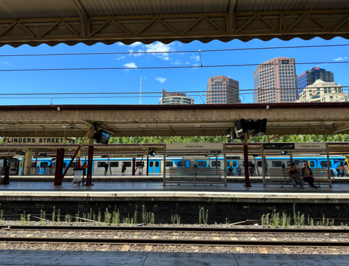

[Challenge Link](https://gralhix.com/list-of-osint-exercises/osint-exercise-002/)

#### Description 
The photo below was shared on social media. It clearly depicts a train station.  
Please answer the following questions: 
1. What is the name of the train station seen in the photo?
2. What is the name and height of the tallest structure seen in the photo?

It's obviously shown in the photo that this is "Flinders Street station".
The location of this station is: **Flinders St, Melbourne VIC 3000، Australia.** 
1. **Lat:  37°49'6.50"S**
2. **Long: 144°57'49.55"E** 
the main buildings appears in the photo:
1. IBM building 132m
2. HWT Building  111 m
3. Focus Melbourne Tower from central equity 166 m 

The Hight structure will be Focus Melbourne from central equity with **166m in height**

Solving Time: **30 mins.**
The most problem I faced is the name of the last Tower (Focus Melbourne)

I want to mention that [MapCarta](https://mapcarta.com/) with a good map solution that helped me in HWT and Focus Melbourne.

